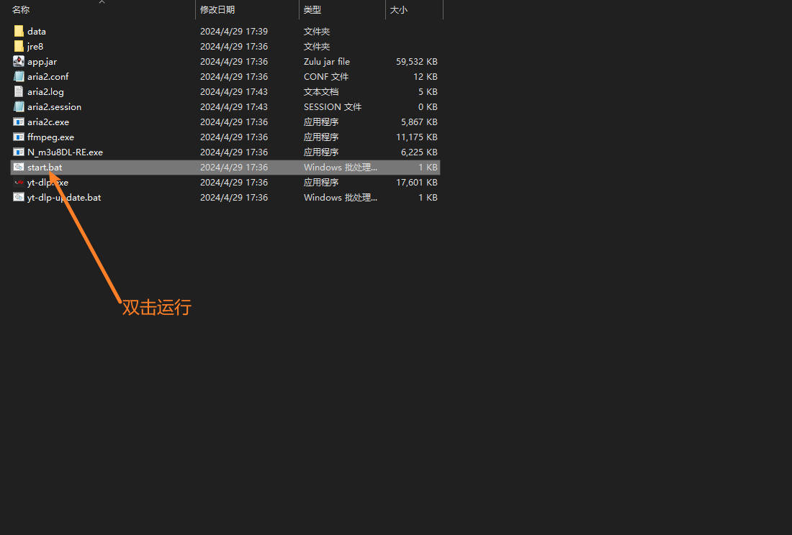
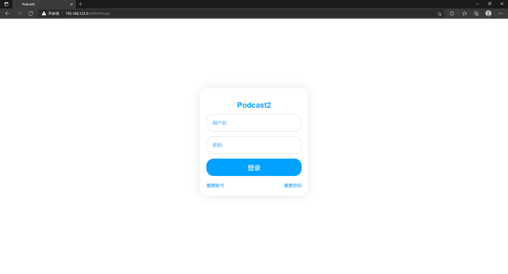
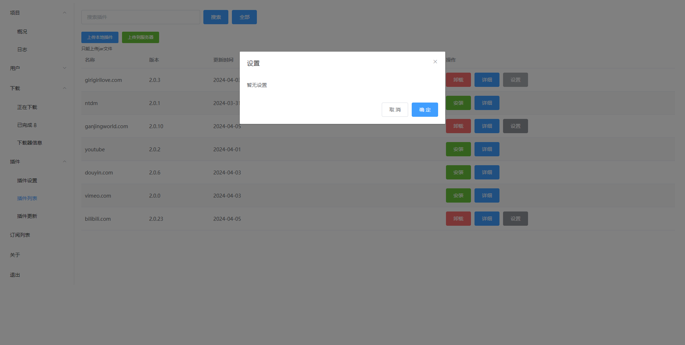
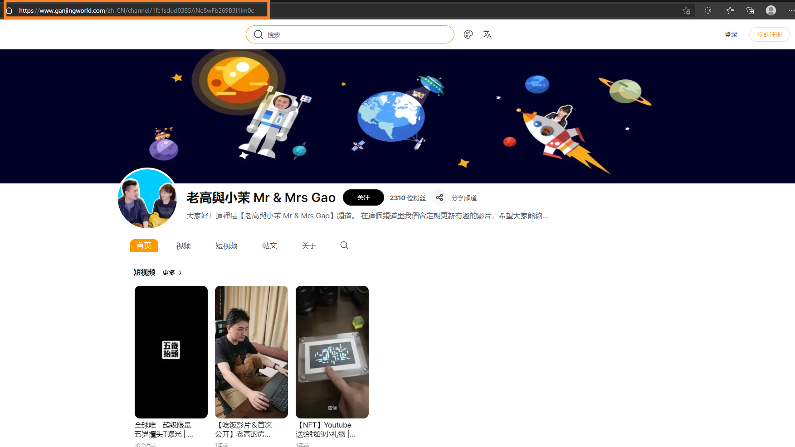
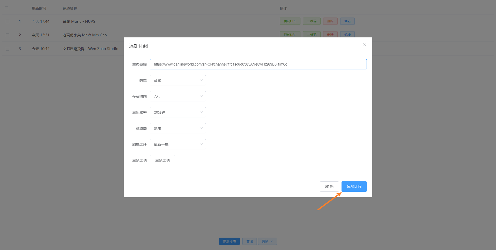

<div align=center></div>

<br>
<p align="center">


</p>
<h2 align=center><p>Podcast2</p></h2>
<hr>

## 项目说明
- 基于spring boot开发
- 将视频网站转换成播客订阅

## 快速开始

#### 使用Docker
1. 安装并启动Docker
```shell
curl -fsSL https://get.docker.com -o get-docker.sh && sh get-docker.sh && systemctl start docker
```
2. 创建并启动Docker
````shell
docker volume create podcast2
docker run -id --name=podcast2 \
-p 8088:8088 \
--restart=always \
--mount source=podcast2,destination=/data \
yajuhua/podcast2:latest
````
3. 防火墙放行端口
````shell
#以下是centos7，其他系统自行搜索。
firewall-cmd --add-port=8088/tcp --permanent
firewall-cmd --reload
````
#### 使用Windows
1. 下载podcast2压缩包
- [下载](https://github.com/yajuhua/podcast2/releases/latest/download/podcast2-win-x64.zip)
- [加速下载](https://github.moeyy.xyz/https://github.com/yajuhua/podcast2/releases/latest/download/podcast2-win-x64.zip)
2. 双击启动


#### 使用macOS
1. 下载podcast2压缩包
- [下载](https://github.com/yajuhua/podcast2/releases/latest/download/podcast2-osx-x64.zip) 
- [加速下载](https://github.moeyy.xyz/https://github.com/yajuhua/podcast2/releases/latest/download/podcast2-osx-x64.zip)
2. 解压得到 platform文件夹
3. 赋执行权限
````shell
chmod -R a+x platform
````
4. 启动
````shell
#进入platform/osx
./start.sh
````
#### 进入面板

> 默认访问地址 [http://你的IP地址:8088]()
>
> 默认用户名：admin <br>
> 默认密码：123456



#### 安装插件
> 项目默认是没有添加插件的，自行按需添加
#### 支持网站
| 网站                           | 状态                                                                                             |
|:---------------------------------------------|------------------------------------------------------------------------------------------------|
| [干净世界](https://ganjing.com/)                 |   |
| [vimeo](https://vimeo.com/)                  |       |
| [ntdm](https://www.ntdm.tv)                  |      |
| [girigirilove](https://www.girigirilove.com) |  | 
| [youtube](https://www.youtube.com)           |     | 
| [bilibili](https://www.bilibili.com)         |     | 
| [抖音](https://www.douyin.com/)                |     | 

1. 安装插件


2. 设置插件，如果有的话


#### 添加订阅
> 以干净世界为例
1. 复制主页链接


2. 粘贴并点击Add


3. 点击二维码


4. 扫描二维码添加到播客APP（如：AntennaPod）


#### 播客APP

<a href="https://www.apple.com/apple-podcasts/" target="_blank">
              
            </a><a href="https://podcastaddict.com/" target="_blank"></a>  <a href="https://antennapod.org/" target="_blank">
                        </a>


## 常见问题
#### 哔哩哔哩设置
> 风控太严，只能选择授权的方式
##### 参考
- [Web端Cookie刷新](https://socialsisteryi.github.io/bilibili-API-collect/docs/login/cookie_refresh.html)
##### 打开浏览器登录哔哩哔哩，最好无痕窗口

##### 复制cookie


##### 复制ac_time_value


##### 注意！这样子相当于登录了，复制后要清理哔哩哔哩浏览器记录，否则会与本插件冲突

<br>

#### 忘记密码
##### 进入数据卷目录
````shell
[root@centos7 ~]# docker volume inspect podcast2
[
    {
        "CreatedAt": "2024-03-23T19:57:47+08:00",
        "Driver": "local",
        "Labels": null,
        "Mountpoint": "/var/lib/docker/volumes/podcast2/_data",
        "Name": "podcast2",
        "Options": null,
        "Scope": "local"
    }
]
[root@centos7 ~]# cd /var/lib/docker/volumes/podcast2/_data
[root@centos7 _data]# ls
cert  config  database  logs  plugin  resources  tmp
[root@centos7 _data]# cd config/
````
##### 修改config.json
````shell
#改成true
{"initUserNameAndPassword":true}
````
##### 重启后将恢复默认用户名和密码
> 用户名 admin
> 密码 123456

#### 开启HTTPS
> 目前仅支持通过上传证书和密钥文件来实现
##### 文件格式要求
````shell
#证书文件格式必须是crt
#密钥文件格式必须是key
````
##### 重启后并以https访问
<br>

##### 更新podcast2
> 数据保留
````shell
# 停止容器
docker stop podcast2

# 删除容器
docker rm podcast2

# 删除本地镜像
docker rmi yajuhua/podcast2:latest

# 拉取最新镜像
docker pull yajuhua/podcast2:latest

#创建新的容器
docker run -id --name=podcast2 \
-p 8088:8088 \
--restart=always \
--mount source=podcast2,destination=/data \
yajuhua/podcast2:latest

````
## 插件bug或失效
由于插件是并非使用官方接口，难免存在不稳定性。若发现插件失效，请[issues](https://github.com/yajuhua/podcast2/issues/new/choose)


## Star History

## 使用到的项目
- [https://github.com/yt-dlp/yt-dlp](https://github.com/yt-dlp/yt-dlp)
- [https://github.com/nilaoda/N_m3u8DL-RE](https://github.com/nilaoda/N_m3u8DL-RE)
- [https://github.com/aria2/aria2](https://github.com/aria2/aria2)
- [https://github.com/SocialSisterYi/bilibili-API-collect](https://github.com/SocialSisterYi/bilibili-API-collect)

## 使用的加速站
- [https://github.moeyy.xyz](https://github.moeyy.xyz)
## 参考
- [https://github.com/mxpv/podsync](https://github.com/mxpv/podsync)
## 免责声明
**此项目仅供研究、学习和交流，请勿用于商业或非法用途， 开发者与协作者不对使用者负任何法律责任， 使用者自行承担因不当使用所产生的后果与责任。**

## 鸣谢
特别感谢 [JetBrains](https://www.jetbrains.com) 为开源项目提供免费的 [IntelliJ IDEA](https://www.jetbrains.com/idea)的授权  
[](https://www.jetbrains.com)


